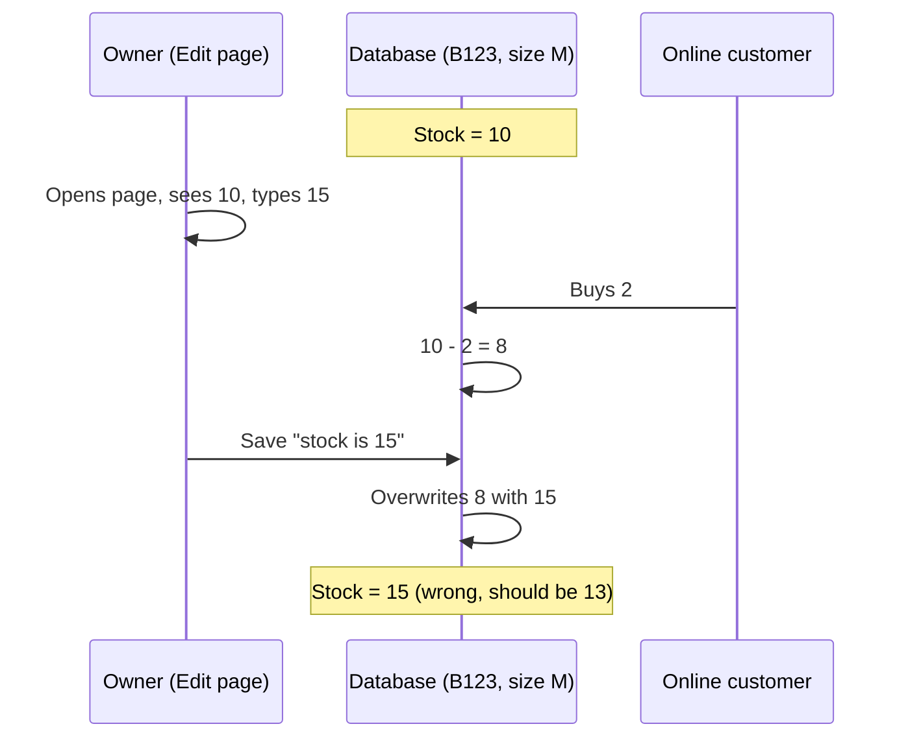
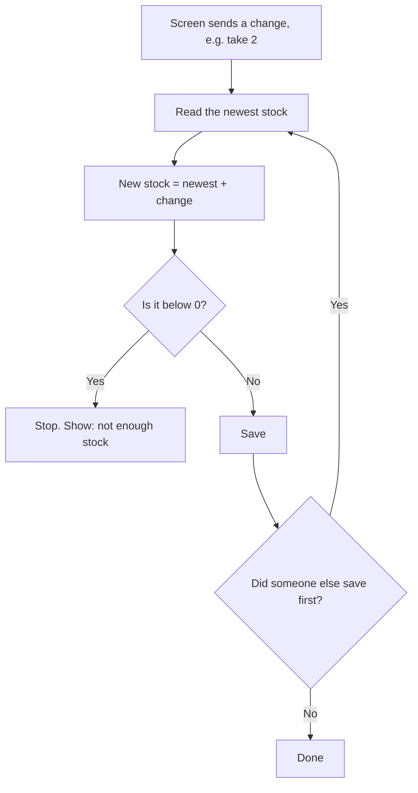
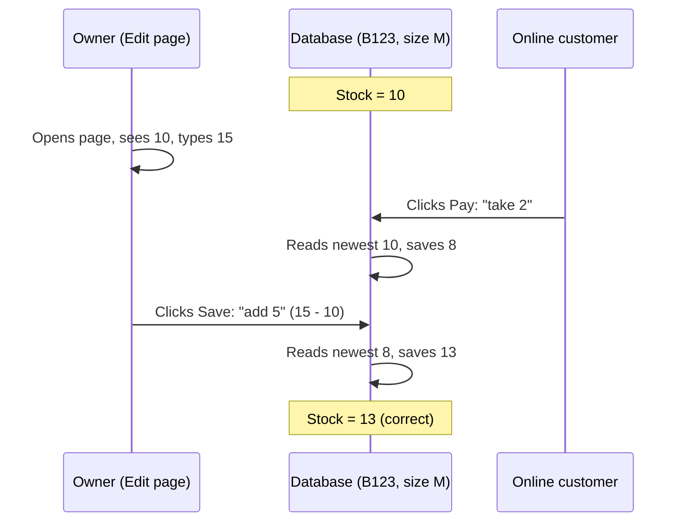
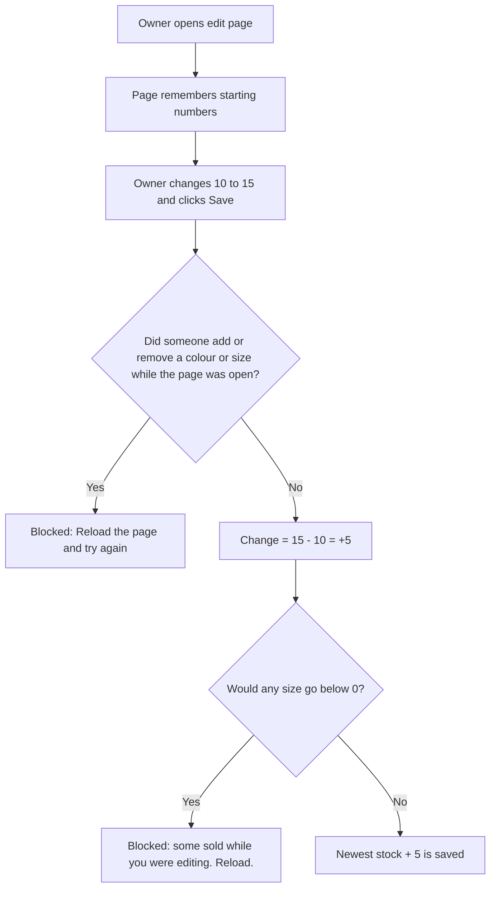
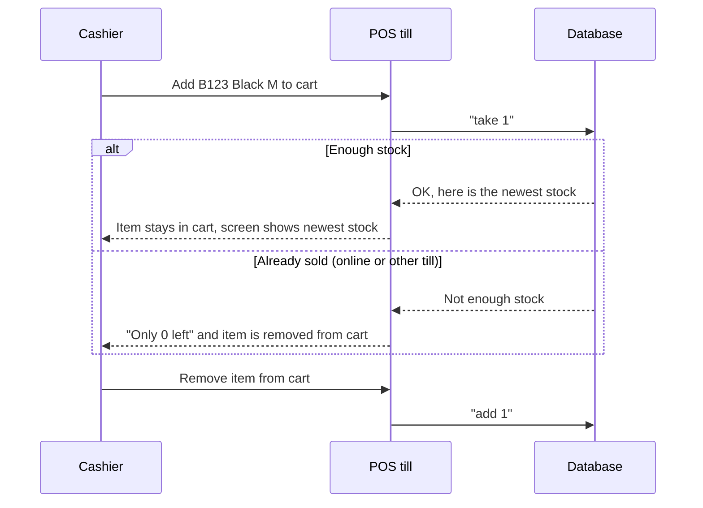
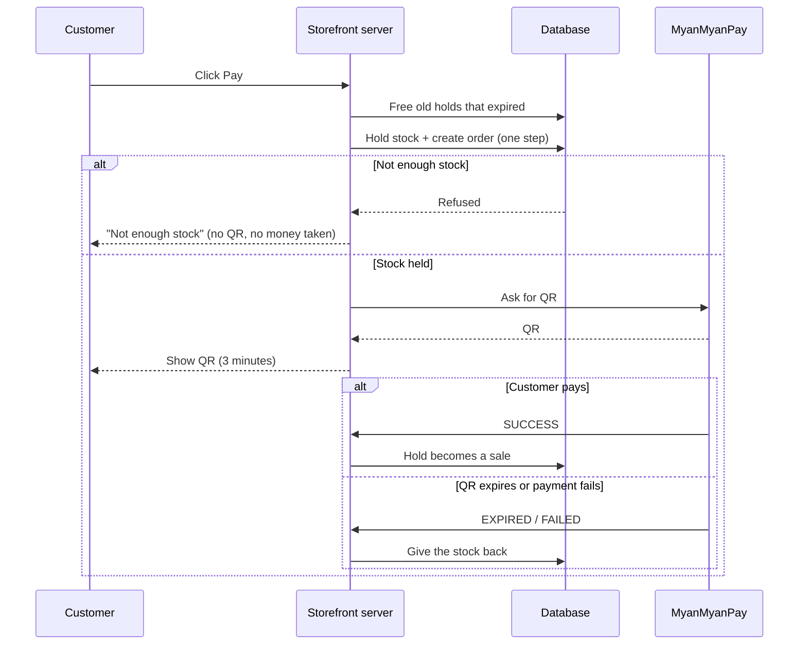
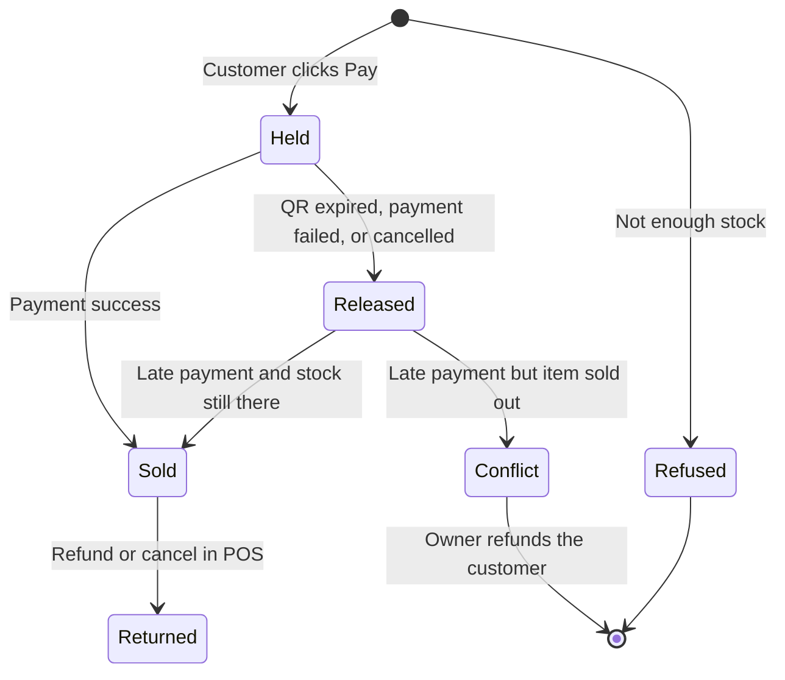
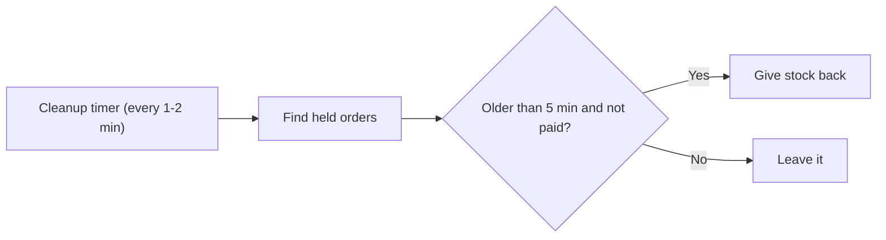
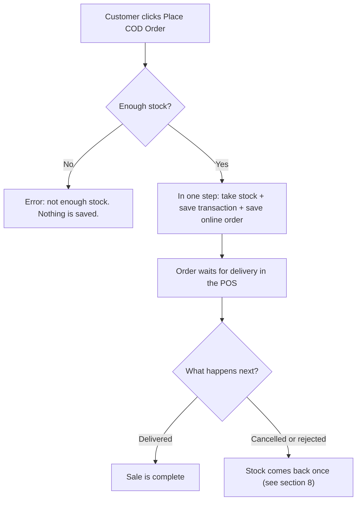
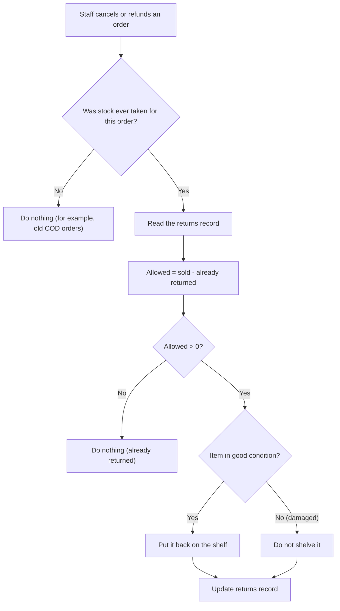

# Stock Workflow: How Stock Stays Correct

This document explains how the POS and the online storefront keep stock correct when several people change it at the same time.

Both apps share one database. Stock for every product lives in `stocks/{productId}`, per colour and size.

---

## 1. The problem we had

Before, every screen saved a **full number**. The last screen to save won, and the other change was lost.



The 2 sold items "came back" in the database, so the shop could sell items it no longer has.

---

## 2. The main idea (the golden rule)

Now every screen sends **only the change**: "add 5" or "take 2". The database does this in one safe step (a *transaction*):

1. Read the **newest** number.
2. Apply the change.
3. Check it is not below 0.
4. Save.

If someone else saved in the middle, the database starts again from step 1 with the newer number. No change is ever lost.



The same example, now correct:



---

## 3. Who changes stock, and when

| Who | Stock goes **down** when... | Stock goes **up** when... |
|---|---|---|
| Owner (edit page) | lowers a number | raises a number (restock) |
| Cashier (POS till) | adds an item to the cart | removes an item from the cart |
| Online, QR payment | clicks **Pay** (stock is held) | QR expires, payment fails, or order is cancelled |
| Online, COD | places the order | order is cancelled, rejected or returned |
| Refund / return in POS | — | item comes back in good condition |

---

## 4. Workflow: owner restocks (edit page)

When the page opens, it remembers the numbers it started with. On **Save** it sends the difference, not the number.



- Names, prices, images and colours are saved as typed.
- Quantities are always saved as a change.

---

## 5. Workflow: cashier sells in the shop (POS till)

Adding to the cart takes the item from stock straight away.



- Each cart change is sent **once**, in order. Before, one change could be sent twice.
- The till no longer erases barcodes when it saves stock.

---

## 6. Workflow: online order with QR payment (MyanMyanPay)

The stock is **held** (reserved) when the customer clicks Pay, **before** the QR is shown. So two customers can never pay for the same last item.



### Life of the stock for one QR order



### When is held stock given back?

A hold is released by whichever of these happens first:

| Trigger | When |
|---|---|
| MyanMyanPay sends **EXPIRED** or **FAILED** | about 3 minutes after the QR is shown |
| The same customer clicks Pay again | their old QR has already expired |
| Any customer clicks Pay | the hold is older than 5 minutes (`STOCK_RESERVATION_TTL_SECONDS`) |
| The cleanup timer calls `/api/stock/release-expired` | every 1–2 minutes (needs setup, see section 10) |
| Owner cancels the order in the POS | any time before payment |
| MyanMyanPay could not create the QR | straight away |



---

## 7. Workflow: online order with Cash on Delivery (COD)

COD has no payment step that can fail, so the stock is **taken for good** when the order is placed.



> **Before this change:** COD orders never took stock, but cancelling one still put stock back. Every cancelled COD order added fake stock.

---

## 8. Workflow: cancel, refund, return (the returns record)

An order can come back through many screens:

- Online Orders page (status → cancelled)
- Transactions page (cancel)
- Cancellation requests (approve)
- Refund requests (approve, with inspection)

Each order now keeps a small **returns record**: how many of each item have already come back. Every screen checks it first and updates it in the same safe step as the stock. So an order can never come back more than it was sold.



### Example: 2 shirts sold

| Step | Action | Returns record | Shelf |
|---|---|---|---|
| 1 | Customer returns 1 shirt, **damaged** | 1 of 2 | +0 |
| 2 | Owner cancels the order on the Online Orders page | 2 of 2 | +1 |
| 3 | Staff also cancels it on the Transactions page | 2 of 2 | +0 (already done) |

Total back on the shelf: **1**. This is correct: 1 is damaged and 1 is fine.

---

## 9. Messages staff and customers may see

| Message | Who | What to do |
|---|---|---|
| "Only N left of ... It may have just sold online or at another till." | Cashier | Item was sold elsewhere. Tell the customer. |
| "This product was changed by someone else while you were editing it. Reload..." | Owner | Reload the edit page and make the change again. |
| "...you lowered the quantity by X, but only Y are left because Z sold..." | Owner | Reload and enter the quantity again. |
| "Insufficient stock for ..." | Online customer | Item sold out. Choose another item or size. |
| Order status `stock_conflict` | Owner (Online Orders) | Customer paid late and the item is gone. Refund the customer. |

---

## 10. Setup checklist

1. **Storefront `.env.local`** (and your hosting settings):
   ```env
   STOCK_RESERVATION_TTL_SECONDS=300
   CRON_SECRET=<a long random string>
   ```
   Make a secret with:
   ```bash
   node -e "console.log(require('crypto').randomBytes(32).toString('hex'))"
   ```
2. **Cleanup timer.** Use Vercel Cron, cron-job.org or similar to call this every 1–2 minutes:
   ```
   GET https://<storefront-domain>/api/stock/release-expired
   Authorization: Bearer <CRON_SECRET>
   ```
   Without it, an abandoned QR checkout keeps the item held until the next online checkout.
3. **Recount COD products once.** Old COD orders never took stock, and some cancelled ones added fake stock. Check the real shelf and fix the numbers on the edit page.

---

## 11. How to test

| # | Steps | Expected |
|---|---|---|
| 1 | Set B123 size M to 10. Open the edit page, change to 15, **do not save**. In another browser buy 2 online (pay). Now click Save. | Stock = **13** |
| 2 | Set stock to 1. Start a QR checkout in two browsers. | Second browser: **not enough stock**, no QR |
| 3 | Start a QR checkout, then let the QR expire. | Stock goes back up within a few minutes |
| 4 | Add the last item to the POS cart while it is held by an online QR. | Cashier sees **Only 0 left**, item removed from cart |
| 5 | Place a COD order for 2. | Stock goes down by 2 straight away |
| 6 | Cancel that COD order on Online Orders, then cancel again on Transactions. | Stock goes up by 2 **once** |
| 7 | Refund 1 item marked **damaged**, then cancel the order. | Only the good item goes back on the shelf |

---

## 12. Known limits

- **Old data is not fixed automatically.** See setup step 3.
- **Late payment after release.** If a customer pays after their hold was released and the item has sold out, the order becomes `stock_conflict` and must be refunded. This is rare.
- **Transaction number gaps.** A COD order refused for low stock still uses up a `TXN-...` number.
- **`PUT /api/stocks/[id]` has no login check.** Anyone who can reach the POS server can change products. This should be protected next.

---

## 13. For developers: where the code lives

| Area | File |
|---|---|
| POS stock maths (changes, owner merge, returns record) | `pos-clothing-store/clothing-store/src/lib/stockMath.ts` |
| POS safe stock writes | `pos-clothing-store/clothing-store/src/services/stockService.ts` (`adjustStock`, `updateStockWithMerge`, `returnOrderLines`) |
| Owner save (merge) | `pos-clothing-store/clothing-store/src/app/api/stocks/[id]/route.ts`, `src/app/owner/inventory/stocks/edit/[id]/page.tsx` |
| POS till cart | `pos-clothing-store/clothing-store/src/app/owner/home/page.tsx`, `src/contexts/CartContext.tsx` |
| POS cancel / refund / reject | `pos-clothing-store/clothing-store/src/services/transactionService.ts` (`returnTransactionStock`) |
| POS online order cancel | `pos-clothing-store/clothing-store/src/services/onlineOrderService.ts` |
| Storefront holds, sales, COD | `pos-clothing-store-web/src/lib/onlineStockService.ts` |
| QR checkout | `pos-clothing-store-web/src/app/api/mmpay/create-order/route.ts` |
| Payment callback | `pos-clothing-store-web/src/app/api/mmpay/webhook/route.ts` |
| COD checkout | `pos-clothing-store-web/src/app/api/transactions/create-cod/route.ts` |
| Cleanup timer endpoint | `pos-clothing-store-web/src/app/api/stock/release-expired/route.ts` |

### Fields stored on orders

| Field | Meaning |
|---|---|
| `stockDeductedAt` | Stock was taken for this order. Without it, nothing is returned. |
| `stockReservationStatus` | QR orders: `reserved` → `committed` (sold) or `released` (given back) |
| `stockReservationExpiresAt` | When an unpaid hold may be released |
| `stockReturnLedger` | Returns record: `{ "<line index>": units already returned }` |
| `stockRestoredAt` | The whole order has come back |
